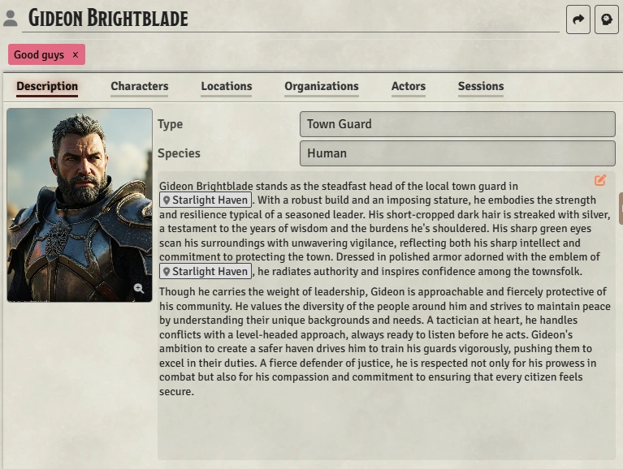
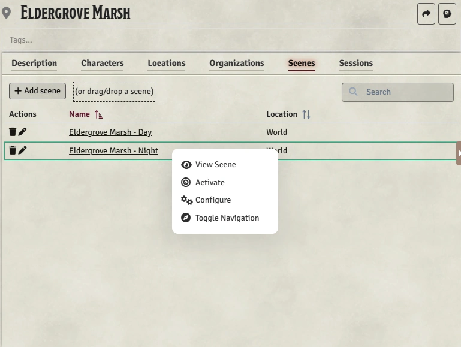

# Entry Window

Regardless of Topic, each Entry has a similar layout in the main window.  At the bottom of this description, we'll outline the things that are different.

## Entry header
The entry header has three main components:
1. Name - This is where you edit the Entry's name.
2. Generate Button (for Characters, Locations, and Organizations)[Advanced Feature] - This gives you the option to generate a description or image for the current entry.  See [TODO-Generate Window] for more details.
3. Tags - In the tags input, you can assign tags to your entry.  To create a new tag, simply type it in and hit Enter/Tab.  As you type, you'll get an auto-complete showing other tags you've already used.  Tags are Topic-specific.  So, for example, if you are in a Location and another Location has been tagged "Region", then you will see "Region" available as an auto-complete.  If you are in an Organization, you won't see that tag available.  Within a topic, a given tag is assigned a random color, but that color will be the same across all Entries with that tag, making it easy to identify.  Tags are given strong preference when [searching](search) (the same as name), so they are a powerful way to find your entries quickly.

## Description tab
The description tab has four main components:
1. Image
2. Type
3. Topic-Specific Fields
4. Description text area

### Image
[TODO - when it's picked and when it's not]

### Type
Type is where you categorize the type of the Entry.  For example, a Character might be a King, a Blacksmith, a Paladin, or a Hero, Villain, NPC, etc.  A Location might be a City, Town, Dungeon, etc.  An Organization might be a Faction, Guild, Cult, etc.  It's completely up to you how to manage and organize your Entries within Types.  Type impacts these areas:
- The Type field is searchable 
- The Topic Sidebar [TODO: link] can be set to group the tree by type - showing you all the entries of a certain type at once.
- It influences AI-generated descriptions and images [Advanced Feature].  

For more complex type management, you can use Tags (see above).

### Topic-Specific Fields
Some Topics have extra fields: 
- Characters - Species - you can optionally set the Species of the Character.  Species is searchable, but more importantly it influences Ai generated descriptions and images [Advanced Features].  See [TODO: link settings?] for more information on managing Species.
- Locations - Parent Location [TODO: Link to hierarchy]
- Organizations - Parent Location [TODO: Link to hierarchy]

### Description Text Area
This is where you enter the description of the Entry.  Click the orange pencil to start editing, and the save button (or Control-S) to save.

## Entry Relationship Tabs
After the Description tab, every entry has four tabs that capture the relationship between this Entry and others.

## Foundry Document Tabs
Finally, after the Entry Relationship tabs, some topics have additional tabs that capture relationships between the Entry and Foundry Documents.  Specifically:

### Characters have an Actors tab

Here you can add an actor (or multiple Actors) from the Foundry world to represent this Character.  This allows you to quickly add the Character to the scene during play.  Since your key Characters will be tied to the current session,  you can access any of them with just a couple clicks.  Having multiple Actors allows you to save different states (for ex. for a werewolf Character), but typically you'll only need one.

Click the Add Actor button to select an actor from the Foundry world.  You can also drag and drop an actor into the list, which allows you to add them from compendiums, as well.

You can drag an actor's token to the scene by grabbing the  icon on the row and dragging it to the scene.

Clicking the actor row will open its Foundry actor/character sheet.

### Locations have a Scenes tab

Here you can add a Scene (or multiple Scenes) from the Foundry world to represent this Location, allowing you to rapidly find the right Scene during play.  Multiple Scene allow you to have a day and night Scene for the Location easily accessible, for example.

Click the Add Scene button to select a Scene from the Foundry world.  You can also drag and drop a Scene into the list, which allows you to add them from compendiums, as well.

Clicking the Scene row will open its Foundry setting panel.  Right clicking the Scene will offer options to view, activate, configure, and toggle the navigation - just like right-clicking a Scene in the Foundry sidebar.
