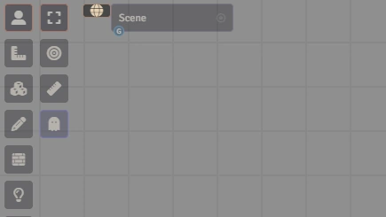

# Getting Started

After installation and activation, you'll find a new button with a globe icon to the left of your scene selection dropdown in the top left corner of your Foundry screen. Clicking this button opens the main interface.

## Your first setting
When you first open the module, you'll be prompted to create your first setting. Almost everything that happens in Campaign Builder is inside of a Setting. These Settings are separate from your Foundry world. Yes, it's confusing.  You can have multiple Settings inside one Foundry world.  All your Characters, Locations, and Campaign information reside within a single Setting and can't cross over between them.  As you'll see later, you can have more than one Campaign in a given Setting, and they can share all of the same Characters, Locations, etc.

Note that there's currently no way to move a Setting between Foundry worlds.  If you have a use case for that, let's talk.

## Where's all this stored?
For the curious, each setting has its own folder in your compendia (in a top-level folder called 'Campaign Builder').  Inside the setting folder is a compendium for the setting.  All of the module's data is stored in Journal Entries inside this compendium.  Don't mess with it if you want everything to keep working.

## Quick-start guides
The quick-start guide is split into two parts, depending on what you want to focus on - setting building, and running a campaign.  These guides are not intended to cover all the functionality available (or you wouldn't need the rest of this documentation).  Instead they cover just enough to get you started and far enough along that you can then explore on your own.

### Setting Building
Setting building primarily takes place in the upper part of the [Directory Sidebar](directory-sidebar.html) - the Topic Directory (named this because it's typically grouped by topic).  The key steps to get you started are:

1. Create a setting (see above)
1. Right click on the topic folders ('Characters', 'Locations', 'Organizations') to create new entries and begin defining your setting

That's basically it - everything else is optional.  Some other things you'll likely want to do, though, include:
* Provide the setting details (this is particularly important if using Advanced Features)
  * Click the setting name in the directory to get to the setting details tab, where you can provide background on the setting
* Give entries more details
  * Give it a type - just enter your new type in the Type box
  * Click on the image box to assign an image
  * Add relationships to other entries on the other tabs 

### Running a Campaign
Running a campaign primarily takes place in the lower part of the [Directory Sidebar](directory-sidebar.html) - the Campaign Directory.  Campaigns are comprised of multiple sessions.  A session is intended to represent a single game session - played in one stretch of time.  Sessions have numbers that determine their order in the campaign.  The session with the highest number is the "active" session, which is important for some features.

Get started:
1. Pick the setting the campaign is in from the Topic Directory
1. Right click on the "[Setting name] Campaigns" header in the Campaign Directory to create a new campaign
1. Right click on the Campaign name to create a new session

For campaigns, there are two modes you need to know about.  "Prep" mode and "Play" mode.  You change between these modes with the toggle in the Campaign Builder window title bar.  If you have more than one campaign with at least one session, you'll see a drop-down where you can pick which campaign you are playing.  

[TODO - image of toggle and campaign dropdown]

#### Prep mode:
In prep mode, you're wrapping up a session that just ended and/or setting up for the next one.  This is where you'll flesh out a session with settings, NPCs, etc.

Prep mode is designed to follow the Lazy DM philosophy, so the main things you'll want to do are:
* Write your "strong start"
* Define any lore that might come up
* Describe possible scenes (called vignettes here to distinguish from Foundry scenes)
* Connect any Locations from the Session - this then gives you quick access to associated Foundry scenes
* Connect any Characters from the Session for your NPCs
* Add any Foundry actors as monsters
* Add any Foundry items for magic items as that might come up

Post-session, there are two key things to look at:
* Review the to-do list for anything that needs attention
* Look through all the session tabs at things that did not get used during the session. Typically, you'll either want to delete them or move them to the next session (by clicking the trash can or arrow on the left side of the table).
  * For lore, you can also move them back to the campaign lore list if you want to keep it but the next session isn't going to be the right time to use it.

#### Play mode:
In play mode, you're actively playing a session.  When you enter play mode, you'll get a session notes popup box where you can record notes as you go.  Every time you hit save, these notes get saved to the notes tabe on the active session, as well.

In play mode, if using Advanced Features, you'll also see new toolbars for [TODO link to the navigation toolbar and generate toolbar].

While in play mode, the things you change in both the current session and in the Setting get tracked in a to-do list, so that after the session you can easily see what came up that you might need to then note or flesh out further.

In play mode, you'll mostly be just playing your game.  Beyond the advanced toolbars, the primary other thing you'll want to do while playing is mark off on the active session any NPCs, lore, Locations, etc. that get used during the session.  You do this by clicking the checkmark on the left side of the table.