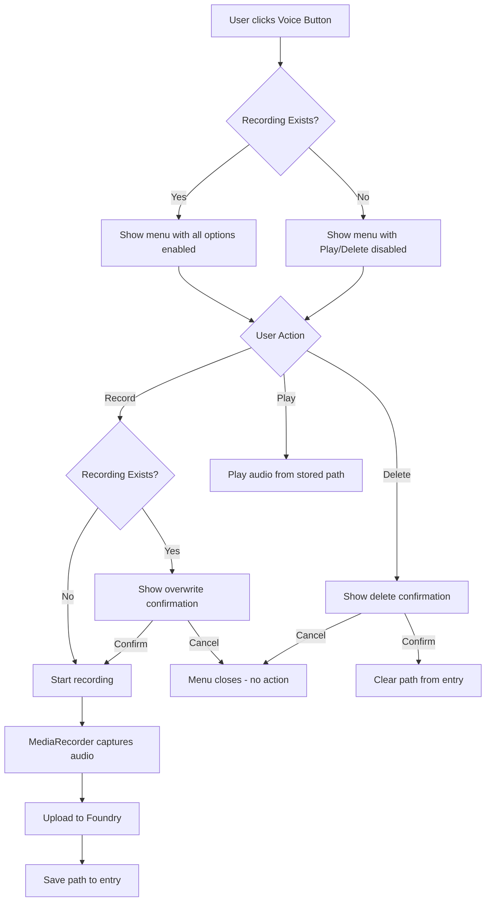
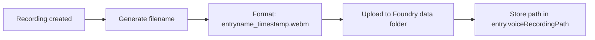

# Voice Recording Feature Implementation Plan

## Overview

Add a feature to capture voice recordings for characters to help GMs remember what voice/accent they used for each character.

## Requirements Summary

1. **Module Setting**: Toggle to enable/disable the feature
2. **Folder Setting**: Configure where recordings are stored
3. **UI Button**: Appears only on Character entries, between AI button and "add to next session" button
4. **Context Menu**: Three options - Record, Play, Delete
5. **Smart States**: Play/Delete only enabled when recording exists
6. **Overwrite Protection**: Confirmation when recording over existing recording
7. **File Naming**: Include entry name and timestamp for user management
8. **No Recording Limit**: Unlimited recording length
9. **Simple Timer**: Recording dialog shows elapsed time, no waveform
10. **Not Exported**: Recordings are NOT included in setting exports
11. **WebM Format**: Use WebM audio format for recordings

## Architecture

### Data Flow



### File Storage



## Implementation Details

### 1. Module Settings

**File**: `src/settings/ModuleSettings.ts`

Add two new settings:

```typescript
// In SettingKey enum
enableVoiceRecording = 'enableVoiceRecording',
voiceRecordingFolder = 'voiceRecordingFolder',

// In displayParams array
{
  settingID: SettingKey.enableVoiceRecording,
  name: 'settings.enableVoiceRecording',
  hint: 'settings.enableVoiceRecordingHelp',
  default: false,
  type: Boolean,
},

// In internalParams array  
{
  settingID: SettingKey.voiceRecordingFolder,
  default: 'voice-recordings',
  type: String,
},
```

### 2. Entry Schema Extension

**File**: `src/documents/entry.ts`

Add a new field to store the recording path:

```typescript
// In EntrySchema
voiceRecordingPath: new fields.FilePathField({
  blank: true, 
  required: false, 
  nullable: true, 
  initial: null,
  categories: ['AUDIO']
}),
```

### 3. Voice Recording Utility Service

**File**: `src/utils/voiceRecording.ts` (new file)

Create a service with these methods:

```typescript
/**
 * Start recording audio from microphone
 * @returns Promise resolving to MediaRecorder instance
 */
startRecording(): Promise<MediaRecorder>

/**
 * Stop recording and get the audio blob
 * @param recorder - The active MediaRecorder
 * @returns Promise resolving to audio Blob
 */
stopRecording(recorder: MediaRecorder): Promise<Blob>

/**
 * Upload audio blob to Foundry
 * @param blob - Audio data
 * @param entryName - Entry name for filename
 * @returns Promise resolving to file path
 */
uploadRecording(blob: Blob, entryName: string): Promise<string>

/**
 * Play audio from path
 * @param path - File path to audio
 */
playRecording(path: string): void

/**
 * Generate filename for recording
 * @param entryName - Name of the entry
 * @returns Filename with entry name and timestamp
 */
generateFilename(entryName: string): string

/**
 * Check if browser supports audio recording
 * @returns boolean indicating support
 */
isRecordingSupported(): boolean
```

### 4. UI Button Implementation

**File**: `src/components/ContentTab/EntryContent/EntryContent.vue`

Add button in header section (between AI button and push-to-session button):

```vue
<button
  v-if="ModuleSettings.get(SettingKey.enableVoiceRecording) && topic===Topics.Character"
  class="fcb-voice-button"
  :class="{ 'has-recording': !!currentEntry?.voiceRecordingPath }"
  data-testid="entry-voice-button"
  @click="onVoiceButtonClick"
  :title="voiceButtonTitle"
>
  <i class="fas fa-microphone"></i>
</button>
```

### 5. Context Menu Implementation

**File**: `src/components/ContentTab/EntryContent/EntryContent.vue`

Add click handler:

```typescript
const onVoiceButtonClick = (event: MouseEvent): void => {
  event.preventDefault();
  event.stopPropagation();

  const hasRecording = !!currentEntry.value?.voiceRecordingPath;
  
  const menuItems = [
    {
      icon: 'fa-microphone',
      iconFontClass: 'fas',
      label: localize('contextMenus.voice.record'),
      disabled: false,
      onClick: () => onRecordVoice()
    },
    {
      icon: 'fa-play',
      iconFontClass: 'fas', 
      label: localize('contextMenus.voice.play'),
      disabled: !hasRecording,
      onClick: () => onPlayVoice()
    },
    {
      icon: 'fa-trash',
      iconFontClass: 'fas',
      label: localize('contextMenus.voice.delete'),
      disabled: !hasRecording,
      onClick: () => onDeleteVoice()
    }
  ];

  ContextMenu.showContextMenu({
    customClass: 'fcb',
    x: event.x,
    y: event.y,
    zIndex: 300,
    items: menuItems,
  });
};
```

### 6. Recording Implementation

Based on the VoiceActor module reference, use MediaRecorder API:

```typescript
const onRecordVoice = async (): Promise<void> => {
  // Check for existing recording
  if (currentEntry.value?.voiceRecordingPath) {
    const confirmed = await FCBDialog.confirmDialog(
      localize('dialogs.voiceRecording.overwriteTitle'),
      localize('dialogs.voiceRecording.overwriteMessage')
    );
    if (!confirmed) return;
  }

  try {
    // Request microphone permission
    const stream = await navigator.mediaDevices.getUserMedia({ audio: true });
    
    // Create recorder
    const recorder = new MediaRecorder(stream);
    const chunks: Blob[] = [];
    
    recorder.ondataavailable = (e) => chunks.push(e.data);
    
    recorder.onstop = async () => {
      const blob = new Blob(chunks, { type: 'audio/webm' });
      
      // Upload to Foundry
      const path = await voiceRecordingService.uploadRecording(
        blob, 
        currentEntry.value.name
      );
      
      // Save to entry
      currentEntry.value.voiceRecordingPath = path;
      await currentEntry.value.save();
      
      // Stop all tracks
      stream.getTracks().forEach(track => track.stop());
      
      notifyInfo(localize('notifications.voiceRecording.saved'));
    };
    
    // Start recording
    recorder.start();
    
    // Show recording dialog with stop button and timer
    showRecordingDialog(recorder);
    
  } catch (error) {
    notifyError(localize('notifications.voiceRecording.permissionDenied'));
  }
};
```

### 7. Playback Implementation

```typescript
const onPlayVoice = (): void => {
  if (!currentEntry.value?.voiceRecordingPath) return;
  
  const audio = new Audio(currentEntry.value.voiceRecordingPath);
  audio.play();
};
```

### 8. Delete Implementation

```typescript
const onDeleteVoice = async (): Promise<void> => {
  const confirmed = await FCBDialog.confirmDialog(
    localize('dialogs.voiceRecording.deleteTitle'),
    localize('dialogs.voiceRecording.deleteMessage')
  );
  
  if (!confirmed) return;
  
  // Note: We cannot delete files from Foundry, so we just clear the reference
  currentEntry.value.voiceRecordingPath = null;
  await currentEntry.value.save();
  
  notifyInfo(localize('notifications.voiceRecording.deleted'));
};
```

### 9. Localization Strings

**File**: `static/lang/en.json`

```json
{
  "fcb": {
    "settings": {
      "enableVoiceRecording": "Enable Voice Recording",
      "enableVoiceRecordingHelp": "Allow recording voice samples for characters to help remember voices/accents"
    },
    "contextMenus": {
      "voice": {
        "record": "Record Voice",
        "play": "Play Voice",
        "delete": "Delete Recording"
      }
    },
    "dialogs": {
      "voiceRecording": {
        "title": "Voice Recording",
        "recording": "Recording... Click Stop when finished.",
        "stop": "Stop",
        "overwriteTitle": "Overwrite Recording?",
        "overwriteMessage": "A voice recording already exists. Do you want to replace it?",
        "deleteTitle": "Delete Recording?",
        "deleteMessage": "Are you sure you want to delete this voice recording? The file will remain on the server but will no longer be linked to this character."
      }
    },
    "notifications": {
      "voiceRecording": {
        "saved": "Voice recording saved",
        "deleted": "Voice recording removed",
        "permissionDenied": "Microphone access denied. Please allow microphone access to record voice.",
        "notSupported": "Voice recording is not supported in this browser"
      }
    },
    "tooltips": {
      "voiceRecording": "Voice recording for this character",
      "voiceRecordingExists": "Voice recording exists",
      "voiceRecordingNone": "No voice recording"
    }
  }
}
```

### 10. Recording Dialog Component

**File**: `src/components/dialogs/VoiceRecordingDialog.vue` (new file)

A simple dialog that shows while recording is in progress with a timer:

```vue
<template>
  <Dialog
    v-model="show"
    :title="localize('dialogs.voiceRecording.title')"
    :buttons="[
      {
        label: localize('dialogs.voiceRecording.stop'),
        default: true,
        close: true,
        callback: onStopClick
      }
    ]"
  >
    <div class="voice-recording-dialog">
      <i class="fas fa-microphone recording-icon"></i>
      <p>{{ localize('dialogs.voiceRecording.recording') }}</p>
      <div class="recording-time">{{ formattedTime }}</div>
    </div>
  </Dialog>
</template>

<style scoped>
.voice-recording-dialog {
  text-align: center;
  padding: 1rem;
}

.voice-recording-dialog .recording-icon {
  font-size: 3rem;
  color: var(--fcb-danger);
  animation: pulse 1s infinite;
}

.voice-recording-dialog .recording-time {
  font-size: 1.5rem;
  font-weight: bold;
  margin-top: 0.5rem;
}

@keyframes pulse {
  0%, 100% { opacity: 1; }
  50% { opacity: 0.5; }
}
</style>
```

### 11. Styles in EntryContent.vue

**File**: `src/components/ContentTab/EntryContent/EntryContent.vue`

Add scoped styles for the voice button:

```vue
<style scoped>
.fcb-voice-button {
  width: 26px;
  height: 26px;
  border: none;
  border-radius: 4px;
  background: var(--fcb-primary);
  color: white;
  cursor: pointer;
  margin-left: 4px;
}

.fcb-voice-button:hover {
  background: var(--fcb-primary-hover);
}

.fcb-voice-button.has-recording {
  color: var(--fcb-success);
}

.fcb-voice-button:disabled {
  opacity: 0.5;
  cursor: not-allowed;
}
</style>
```

## File Changes Summary

| File | Changes |
|------|---------|
| `src/settings/ModuleSettings.ts` | Add `enableVoiceRecording` and `voiceRecordingFolder` settings |
| `src/documents/entry.ts` | Add `voiceRecordingPath` field to schema |
| `src/utils/voiceRecording.ts` | New file - voice recording utility service |
| `src/components/ContentTab/EntryContent/EntryContent.vue` | Add voice button, menu handlers, and scoped styles |
| `src/components/dialogs/VoiceRecordingDialog.vue` | New file - recording in-progress dialog with timer |
| `static/lang/en.json` | Add localization strings |
| `docs/reference/world-building/content/character.md` | Add documentation for voice recording feature |

## Technical Considerations

### Browser Compatibility
- MediaRecorder API is supported in Chrome, Firefox, Edge, and Safari 14.1+
- Should check `isRecordingSupported()` before showing the button

### File Format
- WebM audio format for good compression and wide support

### File Management
- Foundry VTT does not provide an API to delete files
- Filenames include timestamp so users can identify old recordings
- Users can manage files through their file system

### Folder Configuration
- Default folder: `voice-recordings` in the world's data folder

### Permissions
- Requires microphone permission from browser
- Should handle permission denial gracefully

## Testing Checklist

1. [ ] Setting toggle shows/hides button correctly
2. [ ] Button only appears on Character entries
3. [ ] Menu items are correctly enabled/disabled based on recording state
4. [ ] Recording creates and saves audio file
5. [ ] Overwrite confirmation works
6. [ ] Playback works correctly
7. [ ] Delete confirmation works
8. [ ] Delete clears the path but file remains on server
9. [ ] Permission denial is handled gracefully
10. [ ] Browser compatibility check works
11. [ ] Localization strings appear correctly
12. [ ] Button styling matches existing buttons
13. [ ] Recording dialog shows elapsed time
14. [ ] Confirmation cancel closes menu without action

## Documentation

Add documentation to `docs/reference/world-building/content/character.md` describing:
- How to enable the voice recording feature in settings
- How to record a voice sample for a character
- How to play back existing recordings
- How to delete recordings
- Where recordings are stored and how to manage old files
